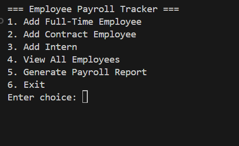
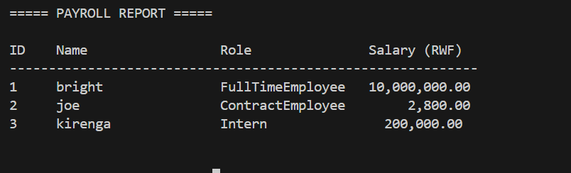

## Employee Payroll Tracker

Command-line app for managing a lightweight in-memory payroll. Add full-time, contract, or intern employees, compute their payouts, and quickly generate a human-readable report.

### Features

- **Polymorphic employees**: dedicated classes for full-time, contract, and intern workers.
- **Central payroll service**: handles O(1) lookups and salary computations.
- **Interactive CLI menus**: add employees, list them, and display payroll summaries.
- **Input validation helpers**: ensure numeric prompts stay clean.
- **Unit tests**: verify key model/service behavior with `pytest`.

### Project Structure

```
employee_Payroll_Tracker/
├── main.py                      # CLI entry point
├── src/employee_payroll_tracker/
│   ├── models/                  # Base + specialized employee types
│   ├── services/                # PayrollService for storage & reports
│   └── utils/                   # CLI helpers (menus, validators, IO)
└── tests/                       # pytest suites
```

### Requirements

- Python 3.11+
- [Poetry](https://python-poetry.org/) (optional but recommended)

### Installation

```bash
git clone https://github.com/JoeBright1619/employe_payroll_tracker.git
cd employee_Payroll_Tracker
poetry install
```

### Running the App

```bash
poetry run python main.py
```

The CLI menu walks you through adding employees and producing reports.

### Running Tests

```bash
poetry run pytest
```

### Typical Flow

1. Add employees (full-time, contract, intern) from the menu.
2. Use `View All Employees` to confirm entries.
3. Generate the payroll report to see salaries per employee.

### Screenshots





### Contributing

1. Create a feature branch off `main`.
2. Run `poetry run pytest` before submitting.
3. Open a PR summarizing changes (docs welcome!).

